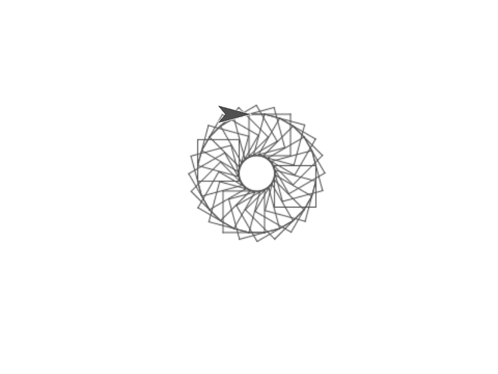
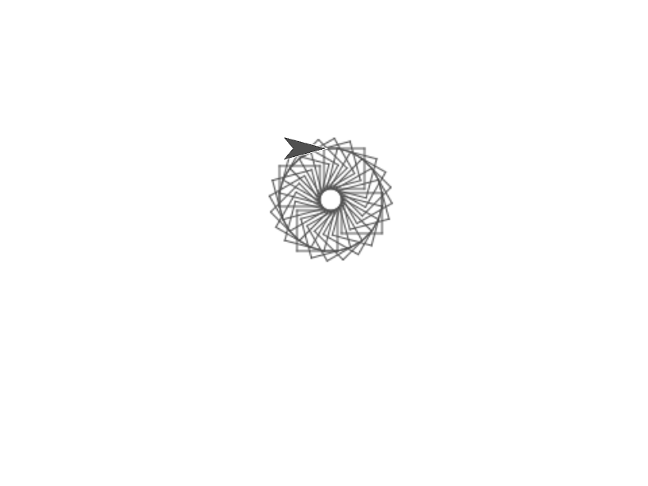

# Lab 2 (Week 3): Get Organized, Then Draw Something

### A group, a plan, and three shapes

**Week 3 · 50 minutes · Wednesday/Thursday**

---

## Learning Goals

By the end of today, you should be able to:

- Read a short Snap script that uses a variable and predict what it does — including telling the difference between *setting* a variable and *changing* it
- Use a `repeat` block to run the same instructions a fixed number of times
- Work out the turn angle a shape needs, and explain why it's that number
- Draw a square, an octagon, and a circle in Snap using only a repeat loop
- Leave lab with a Project 1 Part B group, a divided-up plan, and somewhere to start looking

---

## This Week

Two things today, and they're not related — which is fine, because you need both.

First twenty minutes: get your **Project 1 Part B** group sorted out. Part B is the AI detector experiment, and it's the part with the most moving pieces, so the goal today is organization, not answers. Nobody expects you to walk out with a dataset. We expect you to walk out with a group, a division of labour, and two or three places you're going to go looking.

Then: **Snap**. You met variables and `repeat` loops on Friday. Today you point them at a pen and draw three shapes. By the end you'll have drawn a circle without ever using anything that knows what a circle is — which is a slightly stranger sentence than it looks.

**Counts toward:** Lab completion. One checkoff today, around the 40-minute mark.

---

## Before Lab

- [ ] **Bring a laptop.** You'll be in Snap for the second half.
- [ ] Have a look at the **Project 1 Part B** description if you haven't since Week 2.

**Snap runs in your browser** — nothing to install. Go to [snap.berkeley.edu](https://snap.berkeley.edu) and click *Run Snap!*.

---

## Working Together

The first twenty minutes are **group work** — that's your Part B project group.

The Snap half you do **on your own machine**. Talk to the people around you all you like, and you absolutely should when you're stuck, but everyone builds their own shapes.

---

## How Today Runs

| Part             | What you're doing                                    | About how long |
|------------------|------------------------------------------------------|---|
| Part B           | Getting your group organized                         | 20 min |
| Clicker question | One question, on your own                            | 4 min |
| Shapes 1 and 2   | Square, then octagon                                 | 16 min |
| Shape 3          | Circle, plus colour — **checkoff during this block** | 8 min |
| Wrap             |                                                      | 2 min |

*These are estimates, not a schedule.*

---

## Part B: Get Organized

Part B asks you to build a dataset of real vs. AI-generated content, then run it past several AI-detection tools and see how they do. The dataset has to be **done by the end of next week**, and there's no lab next week — Truth and Reconciliation Day falls on the Wednesday, so this is your last scheduled group time before it's due.

Use it well. Twenty minutes is enough to stop this from becoming a panic in October.

1. **Get into your group.** {{TA: confirm whether groups are pre-assigned or formed here.}}
2. **Everyone say what they're actually able to do.** Who has time when? Who's already used an AI detector? Who's good at the writing-up part?
3. **Pick your medium.** {{Instructor-chosen per the project spec — image, text, video, or chat. TA states which.}} Everything else follows from this.
4. **Decide where the real content comes from.** Which platforms? Be specific — "Instagram" is not a plan, "these three accounts on Instagram" is.
5. **Decide where the AI-generated content comes from.** Which tools are you using to generate it?
6. **Divide the work.** Write down who is doing what, and by when. Aim for concrete: "Sam collects 20 real images by Friday" beats "Sam does images."
7. **Agree how you'll talk to each other** between now and then. Pick one channel and make sure everyone's actually on it.
8. **Start looking.** Spend whatever's left of the twenty minutes actually hunting — open tabs, save links, put them somewhere the whole group can see.

> ### You don't need to finish today
>
> No checkoff on this part, and no expectation that you've found your dataset. The bar is: everyone in your group knows what they're doing this week, and nobody leaves this room without a job.

### If You Finish Early

Start collecting. Anything you gather now is something you don't have to gather next week.

---

## Clicker Question

**One question, about four minutes.** On your own.

Here's a script that's supposed to count from 1 to 5, saying each number as it goes.

```
set (counter) to (0)
repeat (5)
    set (counter) to (1)
    say (counter) for 2 seconds
```

**🔵 Clicker — What does this actually say?**

- A) 1, 2, 3, 4, 5
- B) 0, 1, 2, 3, 4
- C) 1, 1, 1, 1, 1 ✅
- D) 5, 5, 5, 5, 5

---

## Polygons part 1: Square & Octagon

Open Snap. You're going to make the sprite draw shapes by walking around the edges of them.

> ### The pen
>
> Your sprite can hold a pen. When the pen is **down**, the sprite leaves a line everywhere it goes. When it's **up**, it moves without drawing.
>
> The blocks you need are in the **Pen** category: `pen down`, `pen up`, `clear`, and `set pen color to`.

### Shape 1: The square
- Start with the `when Flag is clicked` block and then add a `clear` block and a `pen down` block to start. Run them. 
- Make the sprite draw one side: `move (100) steps`.
- Now turn it: `turn ↻ (90) degrees`.
- You've drawn one side and one corner. A square has four. Wrap those two blocks in a `repeat (4)` block.
- **Run it.** You should get a square.

If your sprite drew a line and then wandered off, check that both the `move` and the `turn` are *inside* the repeat block, not underneath it.

### Shape 2: The octagon
That's the simple one, now you need to do the octagon, I would start by first duplicating the square you created and then think about what values need to be changed to create an octagon

> #### Deliverables
>
> When your octagon works, stay where you are and keep going — your TA will come to you during the next block.
>
> 1. **Show them your octagon** on the stage, and the script that drew it.
> 2. **Tell them what turn angle you used and why** — where the number came from, not just what it is.

---

## Shape 3: The Circle

We actually can't create a circle in Snap, instead what you will end up doing is creating a many-dimensioned polygon.
- Duplicate your octagon script
- Change the # of repeats, the length of each side, and the angle until it resembles a circle. 
- Also just to spice things up, give it a new pen colour, and `clear` first if the stage is getting crowded.

You should get a circle. Except Snap has no idea what a circle is, and neither does your script.

> ### A circle is a polygon that gave up
>
> Nothing you just wrote knows about circles. You drew a **N-sided shape** — and with sides that small, your eye can't tell the difference.
>
> Same pattern all three times: as the number of sides goes up, the turn goes down, and sides × turn always lands on 360.
>
> Hang onto this. It comes back.

### Challenge, If You Finish Early

No checkoff on any of these — they're for you.

The shapes we created are basic, now let's try to make it make something fun. 
Try any of the shapes below






---

## Think It Over

**Nobody collects this and no TA checks it — but write your answers down anyway.** These come back on quizzes and in later labs. Two minutes, in your notebook.

- You used the same three-block pattern for all three shapes and only changed two numbers. Write down the relationship between the number of sides and the turn angle.
- **No right answer:** at what point does a many-sided polygon stop being a polygon and start being a circle? Is there one?

---

## You're Done!

Nice work — you drew a circle out of straight lines, and your project group has a plan.

**Nothing to hand in today.** Before you go, make sure your TA has checked off:

- [ ] Your working **octagon**, and your explanation of the turn angle

And for yourself: the *Think It Over* questions, written somewhere you'll find them again.

**Coming up:** no lab next week (Truth and Reconciliation Day). Your Part B dataset is due at the end of that week, so keep talking to your group. Next lab is Week 5, and you'll be running an algorithm on your own digital life.

---

## Still Stuck?

- **"My sprite moves but doesn't draw."** You need `pen down` before the repeat block. If it's still not drawing, hit `clear` and check the pen colour isn't the same as the background.
- **"My shape doesn't close up."** Your turn angle is off. Sides × turn should equal 360.
- **"Everything's off the edge of the stage."** Add a `go to x: 0 y: 0` and a `point in direction 90` before you start drawing, and use smaller `move` values.
- **"My drawing from last time is still there."** `clear` at the top of your script.
- **Still stuck?** Flag your TA.

---

<!-- ============================================================
     NOT STUDENT-FACING — delete before distributing.
     ============================================================ -->

## Notes for Development — REMOVE BEFORE DISTRIBUTING

**Learning outcomes covered**

From `100 Learning Outcomes UPDATED` → Data Storage in Snap (Friday Programming Class I):

- Use variables in Snap to store and update data → clicker question
- Distinguish `set` from `change` → clicker question (this is the whole point of it)
- Use a fixed-count `repeat` loop, and explain why it beats writing the blocks out by hand → all three shapes
- **CHALLENGE: combine variables, math operators and a repeat loop to construct a geometric shape** → ⚠️ **only partially met — see below**

Plus Project 1 Part B scaffolding, which has no formal LO.

**⚠️ Open decision: the variable LO is currently optional**

The CHALLENGE outcome specifies *"using a variable to hold a value (like number of sides or turn angle) that drives the repeated action."* As drafted, the three required shapes use literal numbers — students never create a variable. The variable-driven version is step 21, in *If You Finish Early*, so only fast students actually do it. The 360 ÷ sides arithmetic happens in their heads, not in Snap.

Three options:

1. **Leave it optional.** The clicker covers `set` vs `change` by reading, and Lecture 15 (Snap 4) formally introduces parameterised shapes anyway. Honest, and the Learning Goals above have been reworded to match what the lab actually guarantees.
2. **Pre-build the square** and hand it out, buying ~4 minutes to make step 21 required. Costs the satisfaction of the first shape working.
3. **Drop the circle** to a finish-early extension and promote the variable version into the main sequence. Cleanest for the LO, but the circle is a deliberate three-week setup for Lecture 15 Q3 — see below.

**Recommendation: option 1 or 2.** Do not drop the circle.

**What students walk in knowing**

Lectures 5 (Snap 1: variables, `set` vs `change`, math operators, `repeat N times`), 6 and 7 (Data privacy). **Snap 2 — If/Else — is Friday, after this lab.** So no conditionals are available. Everything here uses variables, arithmetic, and `repeat` only. Do not add anything that needs a conditional.

**Completion model**

One Deliverable: the octagon, checked around minute 40 while students work on the circle. The Part B block has no checkoff.

**⚠️ This lab feeds Lecture 15 (Snap 4, Week 6) — protect it**

Lecture 15's cold open puts students' own polygon scripts on screen and asks what happens when you need four *different* shapes. **This lab is where those scripts get written.** Two specific dependencies:

- **Q2 in Lecture 15** asks students to realise the turn angle is *derived* (360 ÷ sides) rather than chosen. The "Working out the turn" box here is where they first meet that. Don't cut it.
- **Q3 in Lecture 15** has `draw polygon (50)(5)` producing a "tiny near-circle" as a trap answer. Step 18–20 here is where students *draw* that. The "a circle is a polygon that gave up" box is a deliberate three-week setup.

If the shapes in this lab ever change, Lecture 15's cold open has to change with them.

**TA prep required**

- Run all three shapes yourself in a browser before lab, including the pen colour blocks
- Know the answer to "why doesn't my shape close" cold — it's the most common question by a wide margin
- Confirm whether Part B groups are pre-assigned or formed in lab (step 1 has a placeholder)
- Confirm which medium the instructor has chosen for Part B (step 3 has a placeholder)
- **Checkoff plan:** start sweeping at 0:40. Two questions per student, 30 seconds each. Do not let it become a queue at the front — walk the room.

**Where this is likely to break**

- **Timing.** Square + octagon gets 16 minutes, which is comfortable, but it assumes laptops are open and Snap is loaded. If students arrive without laptops or spend four minutes finding the site, this gets tight fast. Consider asking them to open Snap during the Part B block's last two minutes.
- **The octagon turn angle is the intended difficulty.** Resist giving out 45. The derivation is the LO. Note that **the circle box no longer prints 45** — an earlier draft did, and since the octagon checkoff happens *during* the circle block, a student reading ahead could have answered "why that number" straight off the page. The Still Stuck entry ("sides × turn should equal 360") still yields it, which is the intended safety net.
- **Which of the four "If You Finish Early" options is the real challenge?** Step 21 (the `sides` variable) is the one that matters — it carries a learning outcome and sets up Lecture 15. The other two are filler. Consider cutting them so fast finishers land on the right one.
- **Checkoff queue risk.** Everyone finishes the octagon around the same time. Sweeping during the circle block (rather than having students come to you) is what keeps this from eating ten minutes.
- **Part B groups going quiet.** Twenty minutes of unstructured group time is a long time for a group that doesn't know each other. Steps 2–8 are deliberately concrete for this reason; TAs should circulate and push groups from "discussing" to "writing down who does what."
- **No checkpoint until Week 6.** Deliberate, but it means a group that leaves today without a plan won't be caught for three weeks. TAs should be listening for that during the block even though there's no formal checkoff.

**Clicker answer key**

C — 1, 1, 1, 1, 1. `set` overwrites, so the counter is reset to 1 on every pass; it never accumulates. The fix is `change counter by 1`.

Distractors: A is what the student *intended*, and will be popular. B targets students who think the initial `set to 0` carries through. D targets students who think the loop runs first and the variable ends up at the loop count.

**Think It Over — assessment link**

- Q1 (`set` vs `change`) → Quiz 2, which covers Data Storage in Snap. High-yield.
- Q2 (sides ↔ turn angle relationship) → directly rehearses Lecture 15 Q2, three weeks out
- Q3 (when does a polygon become a circle) → open; a nice abstraction question with no answer, and it previews the idea that a model is always an approximation

**Open questions**

- Are Part B groups pre-assigned, or formed in this lab?
- Which medium is chosen for Part B (image / text / video / chat)?
- Should students open Snap during the Part B block to de-risk the transition?
- Which of the four "If You Finish Early" options is the intended challenge? Currently all four are offered; picking one and cutting the rest may be cleaner.

**Related Images**

- `assets/lab2/pen-blocks.png` — the Pen category blocks
- `assets/lab2/clicker_counter.png` — the clicker script as a Snap screenshot rather than pseudocode
- `assets/lab2/square.png` — square image
- `assets/lab2/octagon.png` — octagon image
- `assets/lab2/circle.png` — circle image
- `assets/lab2/challenge_shape1.png` 
- `assets/lab2/challenge_shape2.png`  
- `assets/lab2/challenge_shape3.png` 
- `assets/lab2/teaching_team` - images for TAs
